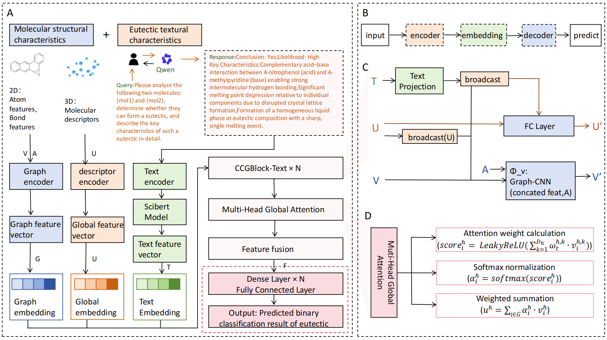

# CrystalCaption: Knowledge-Augmented Multimodal Modeling for Co-crystal Formation Prediction



## Project Overview

CrystalCaption is a novel framework for predicting co-crystal formation between compounds. By integrating textual data with structural features, this approach leverages both prior knowledge from compound text descriptions and structural characteristics to enhance prediction accuracy.

## Key Features

- **Text-enhanced dual-view learning** - Combines molecular structure information with textual data
- **Comprehensive feature extraction** - Utilizes both chemical and text-based features
- **High prediction accuracy** - Achieved through optimized model architecture
- **Flexible and extensible** - Easy to adapt for different co-crystal prediction tasks

## Requirements

- Python 3.7
- Tensorflow (1.6 ≤ Version < 2.0)
- RDKit
- Openbabel 2.4.1
- CCDC Python API (commercial module included in CSD softwares)
- Scikit-learn

## Installation

1. Clone the repository:
   ```bash
   git clone [repository-url]
   cd CrystalCaption
   ```

2. Install the required dependencies:
   ```bash
   pip install -r requirements.txt
   ```

   *Note: CCDC Python API needs to be installed separately as it's a commercial module.*

## Usage

### Running Predictions

To predict co-crystal formation using the trained model:

```bash
python Test/predict.py -table ./Test/Test_Table.tab -mol_dir ./Test/coformers -out cc_test.xlsx -fmt sdf -model_path ./Test/model/model_8/
```

**Parameters:**
- `-table`: Path to the table file of coformer pairs
- `-mol_dir`: Directory of molecular structure files
- `-out`: Output file for prediction results
- `-fmt`: Specify molecular file format (e.g., sdf)
- `-model_path`: Path to the trained model directory

### Training the Model

To train the model from scratch:

```bash
python crosscaption/experiment.py
```

## Project Structure

```
CrystalCaption/
├── Featurize/            # Feature extraction modules
├── Test/                 # Test scripts and model files
├── ablation experiment/  # Ablation study scripts
├── crosscaption/         # Core model implementation
├── data/                 # Datasets and processed features
├── model_img/            # Model architecture images
├── ten_fold_cross_validation/  # Cross-validation scripts
├── text_features/        # Text feature extraction
├── README.md             # Project documentation
└── .gitignore            # Git ignore file
```

## Key Modules

- **Featurize/**: Contains modules for calculating molecular descriptors, fingerprints, and other features
- **crosscaption/**: Core implementation of the CrystalCaption model
- **text_features/**: Tools for extracting and processing text-based features
- **ten_fold_cross_validation/**: Scripts for performing cross-validation experiments

## Data

The project includes various datasets for training and testing:
- **CC_Table/**: Co-crystal table data
- **Mol_Blocks/**: Molecular block data
- **Test/**: Test samples and coformers
- **processed_features/**: Precomputed features

## Model Evaluation

The model has been evaluated using ten-fold cross-validation, achieving high accuracy in predicting co-crystal formation. 

## License

This project is licensed under the [MIT License](LICENSE).

## Acknowledgements

We would like to acknowledge the contributions of all team members and the support of the research community.

## Contact

For questions or issues, please contact the project maintainers.
